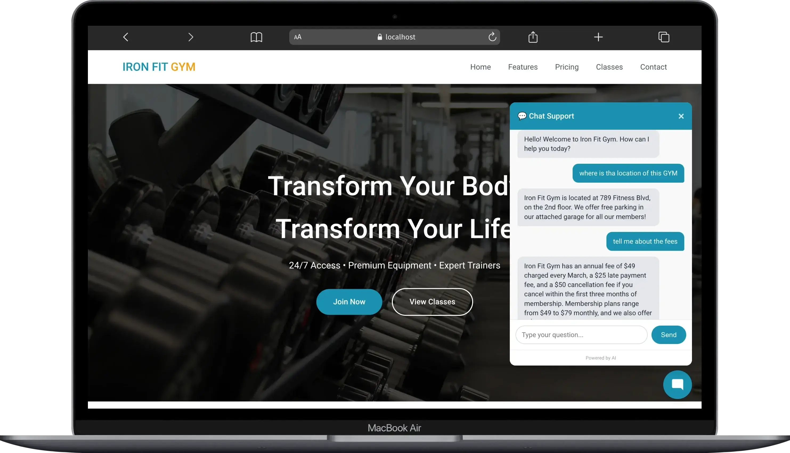
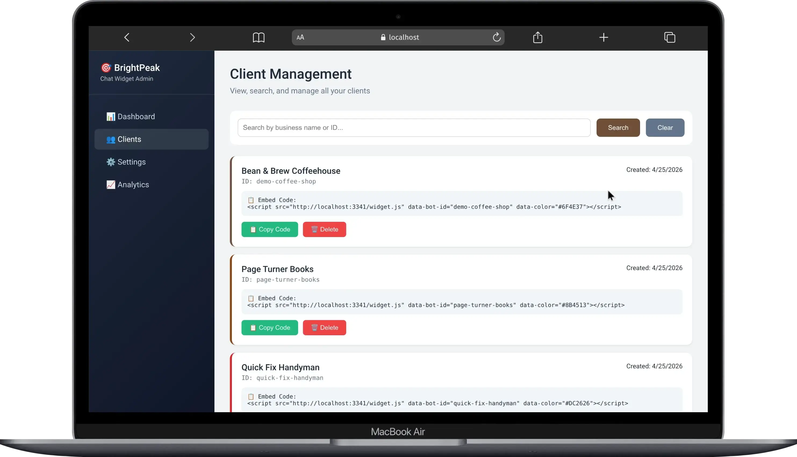
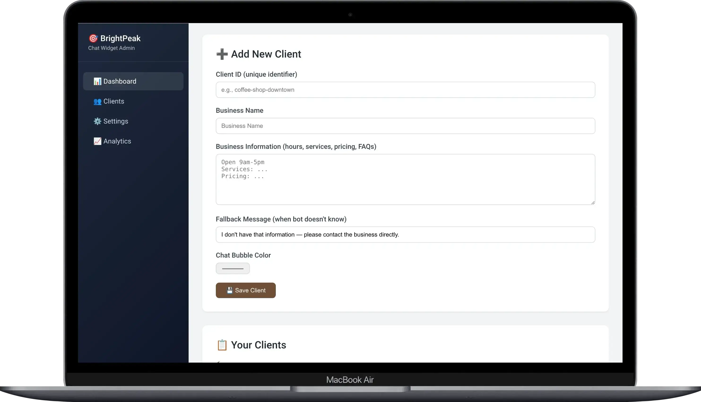

# 🤖 BrightPeak Chat Widget



A white-label AI chat widget that you can embed on any website with ONE line of code. Each client gets their own AI assistant trained on THEIR business information.

## ✨ Features

- **One-Line Embed** - Add to any website in seconds
- **AI-Powered** - Answers questions based on client's actual business info
- **White-Label** - Custom colors per client, no branding
- **Multi-Platform** - Works on Webflow, WordPress, Shopify, Wix, Squarespace, any HTML
- **Admin Panel** - Easy client management dashboard
- **Mobile Friendly** - Responsive chat bubble works on all devices
- **Self-Hosted** - Full control over your data

## 🚀 Quick Start

### For Clients (Website Owners)

Add this ONE line to your website before the `</body>` tag:

```html
<script
  src="https://chatbot-embed-sdk.itsniloy.eu.org/widget.js"
  data-bot-id="YOUR_CLIENT_ID"
  data-color="#YOUR_COLOR"
></script>
```

That's it! The chat bubble will appear automatically.

### For Admins

1. **Start the server**

```bash
npm install
cp .env.example .env
# Add your Gemini API key to .env
node server.js
```

2. **Open Admin Panel**

```txt
https://chatbot-embed-sdk.itsniloy.eu.org/admin
```



3. **Add a client**



- Fill in business information (hours, prices, services)
- Choose a brand color
- Copy the embed code
- Send to your client

## 📋 Prerequisites

- Node.js 18+ or Bun
- Gemini API key from [Google AI Studio](https://aistudio.google.com/)
- Basic knowledge of HTML (for embedding)

## 🛠️ Tech Stack

- **Backend**: Node.js + Express
- **AI**: Google Gemini API
- **Database**: JSON file (lightweight, no setup needed)
- **Frontend**: Vanilla JavaScript (no framework)
- **Styling**: CSS-in-JS (no external dependencies)

## 📁 Project Structure

```txt
chatbot-embed-sdk/
├── src/                      # Source code
│   ├── config/               # Configuration files
│   │   └── database.js      # Database setup
│   ├── controllers/          # Request handlers
│   │   ├── adminController.js
│   │   └── chatController.js
│   ├── middleware/           # Custom middleware
│   │   └── errorHandler.js
│   ├── models/               # Data models
│   │   └── Client.js
│   ├── routes/               # API routes
│   │   ├── adminRoutes.js
│   │   └── chatRoutes.js
│   ├── services/             # Business logic
│   │   ├── aiService.js
│   │   └── databaseService.js
│   └── app.js                # Express app setup
├── admin/                    # Admin panel HTML files
│   ├── index.html           # Dashboard
│   ├── clients.html         # Client management
│   ├── settings.html        # System settings
│   └── analytics.html       # Usage analytics
├── public/                   # Public assets
│   ├── widget.js            # Chat widget script
│   ├── test.html            # Test page
│   └── gym-website.html     # Demo gym website
├── database/                 # JSON database
│   └── clients.json         # Client data storage
├── .env                      # Environment variables
├── Dockerfile                # Docker configuration
├── docker-compose.yml       # Multi-container setup
├── server.js                # Entry point
└── package.json             # Dependencies
```

## 🔧 Configuration

### Environment Variables (.env)

```env
OPENAI_API_KEY=sk-xxxxxx
PORT=3341
```

### Client Data Structure (clients.json)

```json
{
  "clients": {
    "client-id": {
      "id": "client-id",
      "business_name": "Business Name",
      "business_info": "Hours, services, pricing, policies...",
      "fallback_message": "Please call us at...",
      "bubble_color": "#HEXCODE",
      "created_at": "2024-01-01T00:00:00.000Z"
    }
  }
}
```

## 💻 Usage

### Starting the Server

```bash
# Development
node server.js

# Production (with PM2)
npm install -g pm2
pm2 start server.js --name chat-widget
pm2 save
pm2 startup
```

### API Endpoints

| Method | Endpoint                 | Description          |
| ------ | ------------------------ | -------------------- |
| POST   | `/api/chat`              | Send message to AI   |
| GET    | `/api/admin/clients`     | Get all clients      |
| POST   | `/api/admin/clients`     | Create/update client |
| DELETE | `/api/admin/clients/:id` | Delete client        |

### API Example

```bash
# Chat with widget
curl -X POST https://chatbot-embed-sdk.itsniloy.eu.org/api/chat \
  -H "Content-Type: application/json" \
  -d '{"botId":"demo-coffee-shop","message":"What are your hours?"}'

# Create client
curl -X POST https://chatbot-embed-sdk.itsniloy.eu.org/api/admin/clients \
  -H "Content-Type: application/json" \
  -d '{
    "id": "my-business",
    "business_name": "My Business",
    "business_info": "Open 9-5 daily",
    "fallback_message": "Please call us",
    "bubble_color": "#FF0000"
  }'
```

## 🐳 Docker Deployment

### Build and Run

```bash
# Build Docker image
docker build -t brightpeak-chat-widget .

# Run container
docker run -d \
  -p 3341:3341 \
  --name chat-widget \
  --env-file .env \
  brightpeak-chat-widget

# View logs
docker logs -f chat-widget
```

### Docker Compose

```bash
# Start all services
docker-compose up -d

# Stop services
docker-compose down

# View logs
docker-compose logs -f
```

## 🚢 Deployment Platforms

### Coolify Deployment

1. Push code to GitHub
2. Connect repository to Coolify
3. Add environment variables
4. Deploy

### Manual Deployment (Ubuntu/Debian)

```bash
# Install Node.js
curl -fsSL https://deb.nodesource.com/setup_20.x | sudo -E bash -
sudo apt-get install -y nodejs

# Clone and setup
git clone https://github.com/your-repo/chatbot-embed-sdk.git
cd chatbot-embed-sdk
npm install
cp .env.example .env
# Edit .env with your API key

# Setup PM2
npm install -g pm2
pm2 start server.js --name chat-widget
pm2 save
pm2 startup

# Setup Nginx reverse proxy
sudo apt-get install nginx
sudo nano /etc/nginx/sites-available/chat-widget
```

Nginx config:

```nginx
server {
    listen 80;
    server_name chatbot-embed-sdk.itsniloy.eu.org;

    location / {
        proxy_pass http://localhost:3341;
        proxy_http_version 1.1;
        proxy_set_header Upgrade $http_upgrade;
        proxy_set_header Connection 'upgrade';
        proxy_set_header Host $host;
        proxy_cache_bypass $http_upgrade;
    }
}
```

```bash
sudo ln -s /etc/nginx/sites-available/chat-widget /etc/nginx/sites-enabled/
sudo nginx -t
sudo systemctl restart nginx
```

## 📱 Integration Guides

### Webflow

1. Site Settings → Custom Code
2. Paste script in Footer Code
3. Publish

### WordPress

1. Install "Insert Headers and Footers" plugin
2. Paste script in Footer section

### Shopify

1. Online Store → Themes → Edit code
2. Find theme.liquid
3. Paste before `</body>`

### Wix (Business Plan required)

1. Settings → Custom Code
2. Add to Body End

### Squarespace

1. Settings → Advanced → Code Injection
2. Paste in Footer

## 🧪 Testing

### Test Gemini API

```bash
node test-gemini.js
```

### Test Widget Locally

1. Start server: `node server.js`
2. Open `https://chatbot-embed-sdk.itsniloy.eu.org/test.html`
3. Click chat bubble
4. Ask questions

### Test Different Clients

- Coffee Shop: `https://chatbot-embed-sdk.itsniloy.eu.org/gym-website.html` (using gym client)
- Or create custom test pages with different client IDs

## 🔒 Security Considerations

- **API Keys**: Store in `.env`, never commit to git
- **CORS**: Configured to allow all origins (restrict in production)
- **Rate Limiting**: Add for production use
- **Authentication**: Add login for admin panel in production

## 📊 Performance

- **Response Time**: ~1-2 seconds (depends on Gemini API)
- **Concurrent Users**: Handles 100+ concurrent chats
- **Memory Usage**: ~50MB base + 1MB per client
- **Database**: JSON file, good for 1000+ clients

## 🐛 Troubleshooting

### Widget Doesn't Appear

- Check browser console (F12)
- Verify script tag has `data-bot-id`
- Ensure server is running
- Check CORS settings

### AI Gives Wrong Answers

- Review business info in admin panel
- Make info clear and specific
- Test with exact wording

### Gemini API Errors

- Verify API key in `.env`
- Check model name: `gemini-3-flash-preview`
- Enable billing on Google Cloud

### Docker Issues

- Check logs: `docker logs chat-widget`
- Verify environment variables
- Ensure ports are available

## 📝 License

MIT License - Free for commercial and personal use
